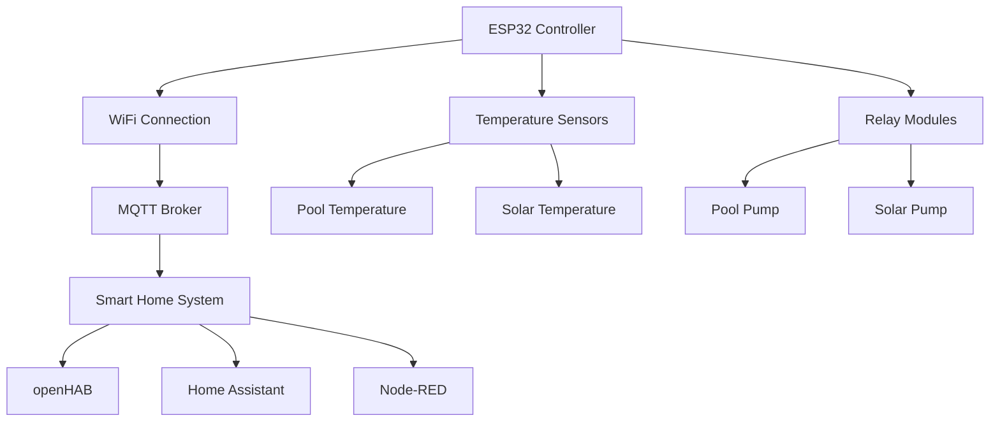

# Pool Controller MicroPython

Welcome to the MicroPython version of the Smart Swimming Pool Controller!

## Overview

The Pool Controller is a smart IoT device that automates your swimming pool's pump and heating system. Built for ESP32 microcontrollers running MicroPython, it provides intelligent control based on temperature sensors and configurable rules.

## Key Features

- **🌡️ Temperature Monitoring**: DS18B20 sensors for pool and solar temperatures
- **🔄 Intelligent Control**: Multiple operation modes (Auto, Manual, Timer, Boost)
- **📡 MQTT Integration**: Homie 4.0 compatible for easy smart home integration
- **⏰ Timer Control**: Configurable pump schedules
- **🔧 Easy Configuration**: JSON-based configuration system
- **📱 Remote Control**: Full MQTT-based remote control and monitoring

## Quick Start

1. **Flash MicroPython** to your ESP32
2. **Copy files** to the ESP32 filesystem
3. **Configure** your WiFi and MQTT settings in `config.json`
4. **Connect hardware** according to the wiring diagram
5. **Reset** the device and enjoy automated pool control!

## Architecture

## Operation Modes

### Auto Mode
Intelligent control based on temperature readings and timer settings. The system automatically manages both pool and solar pumps for optimal efficiency.

### Manual Mode
Complete manual control via MQTT commands. Perfect for maintenance or special situations.

### Timer Mode
Pool pump runs on schedule, solar pump disabled. Simple time-based operation.

### Boost Mode
Aggressive heating mode that maximizes solar energy utilization when the pool pump is running.

## Hardware Requirements

- ESP32 development board
- 2× DS18B20 temperature sensors
- 2× 5V relay modules
- Pull-up resistors (4.7kΩ)
- Power supply and wiring

## Software Requirements

- MicroPython firmware 1.19+
- MQTT broker (Mosquitto, etc.)
- Smart home system (optional)

## Getting Help

- 📖 [Documentation](https://smart-swimmingpool.github.io/pool-controller)
- 🐛 [Issue Tracker](https://github.com/smart-swimmingpool/pool-controller/issues)
- 💬 [Discussions](https://github.com/smart-swimmingpool/pool-controller/discussions)

## License

This project is licensed under the MIT License - see the [LICENSE](LICENSE) file for details.