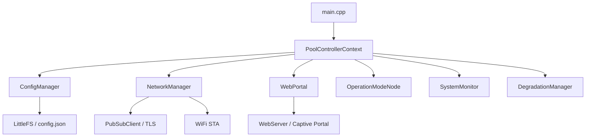

# Implementation Plan — Fresh Installation with Premium Web Setup Portal

This plan details the architecture and implementation steps to build a fresh, state-of-the-art **Pool Controller** featuring a premium, password-protected **Web Setup Portal (Captive Portal)**, **pure Home Assistant MQTT Discovery**, and **standard security features** (MQTT TLS, signed OTA, and flash encryption).

---

## User Review Required

> [!IMPORTANT]
> **Key Decisions & Requirements (Updated):**
> 1. **Fresh Installation (No Migration)**: Backward compatibility with Homie `/homie/config.json` migration is not required. We are doing a clean installation using **`LittleFS`** and `/config.json`.
> 2. **Captive Web Portal**: If no configuration exists or WiFi connection fails (20-second timeout), the device automatically starts a WiFi Access Point (`Pool-Controller-Setup`) and a DNS captive portal.
> 3. **Password-Protected Web Interface**: Once connected to the home network, the web interface remains accessible at the local IP but requires a **password** (configurable by the user during setup, e.g., default `admin`) to read/write settings.
> 4. **Premium Design**: The Web UI will be designed with high-end glassmorphism, responsive controls, live charts, and smooth animations matching a luxury smart-home application.
> 5. **Standard Security & ArduinoJson v7**: Includes full MQTT TLS, signed OTA firmware build profiles, and the modern **ArduinoJson 7.x** API.

---

## Proposed Architecture

Instead of the unmaintained Homie framework, the system will use a highly robust, cooperative, and modular architecture:

### 1. Configuration (`ConfigManager`)
* **Storage**: `/config.json` on `LittleFS` storing WiFi, MQTT, NTP, setpoint configurations, and the web admin password hash.
* **JSON Library**: Upgraded to **ArduinoJson v7** for memory efficiency and safe allocations.

### 2. Web Portal & Captive Setup (`WebPortal`)
* **Libraries**: Standard Espressif `WebServer.h` and `DNSServer.h`. Extremely stable, no memory leaks.
* **AP Mode**: If WiFi fails or `/config.json` is missing, the controller spawns a `Pool-Controller-Setup` AP and redirects all DNS queries to `192.168.4.1`.
* **Aesthetics**: Premium responsive UI with a dark glassmorphism design:
  - Teal/Cyan accent colors (refreshing pool water look).
  - Amber/Orange accents for solar pump activation.
  - Interactive forms for WiFi (with network scan), MQTT, and setpoints.
* **Password Protection**: Accessing the API/Web UI on STA mode requires authentication. Session tokens or basic authentication will be enforced.

---

## Proposed Changes

### Build Configuration

#### [MODIFY] [platformio.ini](file:///mnt/ssd/projects/pool-controller/platformio.ini)
* Remove `git+https://github.com/homieiot/homie-esp8266.git#develop` and `marvinroger/AsyncMqttClient`.
* Add `knolleary/PubSubClient` (or approved alternative) and `bblanchon/ArduinoJson @ 7.3.0`.
* Upgrade platform to `espressif32 @ 6.9.0`.
* Configure partitions to support `LittleFS` instead of SPIFFS.

---

### Core & Network Layer

#### [NEW] [ConfigManager.hpp](file:///mnt/ssd/projects/pool-controller/src/ConfigManager.hpp) / [ConfigManager.cpp](file:///mnt/ssd/projects/pool-controller/src/ConfigManager.cpp)
* Mount `LittleFS` and manage serialization/deserialization of `/config.json`.
* Store hashed admin passwords for the Web UI.

#### [NEW] [NetworkManager.hpp](file:///mnt/ssd/projects/pool-controller/src/NetworkManager.hpp) / [NetworkManager.cpp](file:///mnt/ssd/projects/pool-controller/src/NetworkManager.cpp)
* Manage STA connection, reconnection cycles, and status updates.
* Handle WPS provisioning.
* Initialize standard `PubSubClient` with `WiFiClientSecure` for TLS.

#### [NEW] [WebPortal.hpp](file:///mnt/ssd/projects/pool-controller/src/WebPortal.hpp) / [WebPortal.cpp](file:///mnt/ssd/projects/pool-controller/src/WebPortal.cpp)
* Serve the premium Web UI assets (HTML/CSS/JS).
* Implement the Captive Portal DNS redirection.
* Expose API endpoints for:
  - `/api/scan` — scan WiFi networks.
  - `/api/config` — read/write system configuration (password-protected on STA mode).
  - `/api/status` — read live sensor values and pump states.
* Support password validation using simple SHA-256 or secure comparison.

#### [MODIFY] [PoolController.hpp](file:///mnt/ssd/projects/pool-controller/src/PoolController.hpp) / [PoolController.cpp](file:///mnt/ssd/projects/pool-controller/src/PoolController.cpp)
* Replace all Homie framework setups, events, and settings with `ConfigManager`, `NetworkManager`, and `WebPortal`.
* Implement non-blocking state checks in `loop()`.

---

### Home Assistant Discovery

#### [NEW] [MqttPublisher.hpp](file:///mnt/ssd/projects/pool-controller/src/MqttPublisher.hpp) / [MqttPublisher.cpp](file:///mnt/ssd/projects/pool-controller/src/MqttPublisher.cpp)
* Publish Home Assistant Discovery and state updates.
* Consolidate all entities into a single "Pool Controller" device using the MAC address as the identifier (F5 Fix).
* Implement LWT and availability topic (F6 Fix).
* Expose diagnostics (F8 Fix).

---

### Clean Code & Base Rule Refactoring

#### [MODIFY] [Rule.hpp](file:///mnt/ssd/projects/pool-controller/src/Rule.hpp)
* Move duplicate `checkPoolPumpTimer()` logic from `RuleAuto` and `RuleTimer` into this base class (F21 Fix).
* Mark getters as `const` (F23 Fix).

#### [MODIFY] [RuleAuto.cpp](file:///mnt/ssd/projects/pool-controller/src/RuleAuto.cpp) / [RuleTimer.cpp](file:///mnt/ssd/projects/pool-controller/src/RuleTimer.cpp)
* Remove duplicate code.
* Replace Homie loggers with modern injected or static system logger.

#### [MODIFY] [main.cpp](file:///mnt/ssd/projects/pool-controller/src/main.cpp)
* Prevent serial block timeout (F29 Fix).

---

### Deleted Files (Homie Cleanup)

#### [DELETE] [MqttInterface.hpp](file:///mnt/ssd/projects/pool-controller/src/MqttInterface.hpp)
#### [DELETE] [HomeAssistantMQTT.hpp](file:///mnt/ssd/projects/pool-controller/src/HomeAssistantMQTT.hpp)
#### [DELETE] [HomeAssistantMQTT.cpp](file:///mnt/ssd/projects/pool-controller/src/HomeAssistantMQTT.cpp)
#### [DELETE] [LoggerNode.hpp](file:///mnt/ssd/projects/pool-controller/src/LoggerNode.hpp)
#### [DELETE] [LoggerNode.cpp](file:///mnt/ssd/projects/pool-controller/src/LoggerNode.cpp)

---

## Security Implementation (Q2 Standard Level)

1. **Password-Protected Web UI**:
   - The setup page will require setting a strong password.
   - When accessed in station mode, a premium login screen will be displayed.
   - Uses HTTP session cookies or token validation.
2. **MQTT TLS (F10)**:
   - Configure `WiFiClientSecure` with the broker's TLS configurations.
   - Support both full Root CA certificate validation and insecure TLS (via config).
3. **Flash Encryption & Secure Boot Support (F1, F11, F14)**:
   - Provide platformio build profiles with ESP32 partition tables supporting signed OTA updates and app rollbacks.
   - Prevent plaintext credential writing by using ESP32 Flash Encryption.
   - Document concrete commands for physical key burning (`espsecure.py`, `espefuse.py`) in `docs/security-setup.md`.
4. **Signed OTA (F1, F2, F3)**:
   - Integrate ESP32 anti-rollback APIs (`esp_ota_mark_app_valid_cancel_rollback()`).
   - Deliver OTA firmware chunks securely over HTTPS via the Home Assistant MQTT Update Entity.

---

## Verification Plan

### Automated Tests
1. **Compilation Validation**: Run `pio run` to verify that all new LittleFS, WebServer, ArduinoJson 7.x, and PubSubClient integrations compile flawlessly.
2. **Unit Testing**: Run `pio test` on core rule engines to ensure the extracted base class `checkPoolPumpTimer()` functions correctly under normal and midnight-crossing schedules.

### Manual & Staging Verification
1. **Captive Portal Verification**: Connect to `Pool-Controller-Setup` AP, navigate to `http://192.168.4.1`, scan networks, enter credentials, and configure settings.
2. **API Protection Verification**: Confirm that accessing `/api/config` without a valid password session returns a `401 Unauthorized` error when in STA mode.
3. **HA Entity Consolidation**: Connect the controller to an MQTT broker, observe HA Discovery payloads, and confirm that all entities belong to exactly *one* unified device in Home Assistant.
